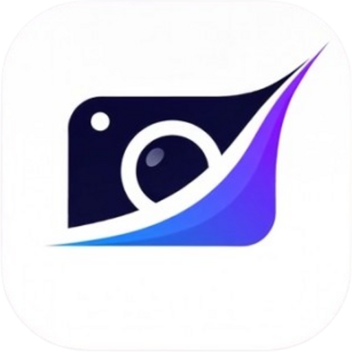

<p align="center">
  
</p>

<h1 align="center">SwipeClean</h1>

<p align="center">
  <strong>Limpia tu galería con swipes estilo Tinder</strong>
</p>

<p align="center">
  <a href="#características">Características</a> •
  <a href="#instalación">Instalación</a> •
  <a href="#uso">Uso</a> •
  <a href="#tecnologías">Tecnologías</a> •
  <a href="#contribuir">Contribuir</a>
</p>

<p align="center">
  
  
  
  
</p>

---

## 📱 ¿Qué es SwipeClean?

**SwipeClean** es una aplicación móvil que te ayuda a limpiar las fotos de tu dispositivo de forma rápida y divertida, usando gestos de swipe como en Tinder.

¿Tienes miles de fotos acumuladas y no sabes cuáles borrar? Con SwipeClean puedes revisar tus fotos una por una con simples gestos:

- 👈 **Swipe izquierdo** = Enviar a papelera
- 👉 **Swipe derecho** = Conservar

¡Así de fácil!

---

## ✨ Características

### 🎴 Sistema de Swipes Intuitivo
- Interfaz estilo Tinder para revisar fotos
- Indicadores visuales al hacer swipe
- Vista previa de la foto completa
- Tap para ver en pantalla completa con zoom

### 🗑️ Papelera Inteligente
- Las fotos no se eliminan inmediatamente
- Papelera persistente entre sesiones
- Restaura fotos si cambias de opinión
- Selección múltiple para eliminar o restaurar
- Confirmación antes de eliminar permanentemente

### 📁 Organización por Álbumes
- Visualiza todos tus álbumes
- Filtra fotos por álbum específico
- Contador de fotos por álbum

### 🔍 Detección de Duplicados
- Algoritmo de hashing perceptual
- Encuentra fotos similares automáticamente
- Agrupa duplicados para fácil revisión
- Elimina duplicados con un tap

### 📊 Estadísticas en Tiempo Real
- Total de fotos en el dispositivo
- Fotos revisadas
- Fotos en papelera
- Fotos pendientes de revisar

### 🎨 Diseño Moderno
- Tema oscuro elegante
- Interfaz completamente responsive
- Animaciones suaves
- Compatible con cualquier tamaño de pantalla

---

## 📸 Capturas de Pantalla

<p align="center">
  <i>Próximamente...</i>
</p>

<!--
<p align="center">
  
  
  
  
</p>
-->

---

## 🚀 Instalación

### Requisitos Previos
- Flutter 3.0 o superior
- Android SDK
- Dispositivo Android 5.0+ o emulador

### Clonar el Repositorio

```bash
git clone https://github.com/Avzolem/swipeclean.git
cd swipeclean
```

### Instalar Dependencias

```bash
flutter pub get
```

### Generar Código (Hive)

```bash
flutter pub run build_runner build --delete-conflicting-outputs
```

### Ejecutar la App

```bash
# En modo debug
flutter run

# Compilar APK release
flutter build apk --release
```

---

## 📖 Uso

### Pantalla Principal
Al abrir la app, verás las estadísticas de tu galería y los botones para acceder a cada función.

### Limpiar Fotos
1. Toca **"Empezar a limpiar"**
2. Revisa cada foto:
   - **Swipe izquierdo** → Papelera
   - **Swipe derecho** → Conservar
   - **Tap** → Ver en pantalla completa
3. Las fotos van a una papelera temporal

### Gestionar Papelera
1. Toca **"Ver papelera"**
2. Selecciona las fotos que quieras gestionar
3. Elige:
   - **Restaurar** (verde) → Vuelven a la cola
   - **Eliminar** (rojo) → Se borran del dispositivo

### Ver Duplicados
1. Toca **"Duplicadas"**
2. Espera el análisis automático
3. Revisa los grupos de fotos similares
4. Selecciona y elimina las que no necesites

---

## 🛠️ Tecnologías

| Tecnología | Uso |
|------------|-----|
| **Flutter** | Framework de desarrollo |
| **Dart** | Lenguaje de programación |
| **Provider** | Gestión de estado |
| **Hive** | Base de datos local |
| **photo_manager** | Acceso a galería |
| **flutter_card_swiper** | Gestos de swipe |

---

## 📁 Estructura del Proyecto

```
lib/
├── main.dart                 # Punto de entrada
├── models/                   # Modelos de datos
│   ├── photo.dart
│   └── trash_item.dart
├── providers/                # Estado global
│   ├── photo_provider.dart
│   └── trash_provider.dart
├── screens/                  # Pantallas
│   ├── home_screen.dart
│   ├── swipe_screen.dart
│   ├── trash_screen.dart
│   ├── albums_screen.dart
│   └── duplicates_screen.dart
├── services/                 # Lógica de negocio
│   ├── photo_service.dart
│   ├── storage_service.dart
│   └── duplicate_detector.dart
└── widgets/                  # Widgets reutilizables
    └── swipe_card.dart
```

---

## 🤝 Contribuir

¡Las contribuciones son bienvenidas! Si quieres mejorar SwipeClean:

1. Haz un Fork del proyecto
2. Crea una rama para tu feature (`git checkout -b feature/NuevaFuncion`)
3. Haz commit de tus cambios (`git commit -m 'Agregar nueva función'`)
4. Push a la rama (`git push origin feature/NuevaFuncion`)
5. Abre un Pull Request

### Ideas para Contribuir
- [ ] Soporte para videos
- [ ] Tema claro/oscuro configurable
- [ ] Estadísticas de espacio liberado
- [ ] Detección de fotos borrosas con ML
- [ ] Internacionalización (i18n)
- [ ] Tests unitarios

---

## 📄 Licencia

Este proyecto está bajo la Licencia MIT. Consulta el archivo [LICENSE](LICENSE) para más detalles.

---

## 👨‍💻 Autor

<p align="center">
  <strong>Desarrollado con ❤️ por <a href="https://avsolem.com">avsolem.com</a></strong>
</p>

---

<p align="center">
  <sub>¿Te gusta SwipeClean? ¡Dale una ⭐ al repo!</sub>
</p>
